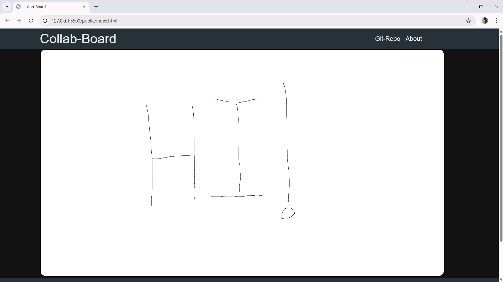

# collab-board

# 🖊️ Live Collaborative Canvas Board

A real-time collaborative whiteboard app built with **HTML5 Canvas**, and **websocket** 
Multiple users can draw on the same board simultaneously and see each other's updates instantly.

---

## 🚀 Features

- 🎨 Real-time collaborative drawing
- 🧭 Maintains a 16:9 responsive canvas
- ⚡ Live stroke broadcasting using WebSockets
- 🧑‍🤝‍🧑 Multi-user support
- 🧱 Built with simple and clean architecture

---

---

## 🧰 Tech Stack

- **Frontend:** HTML, CSS, JavaScript (Canvas API)
- **Backend:** Node.js
- **Realtime:** websocket

---
